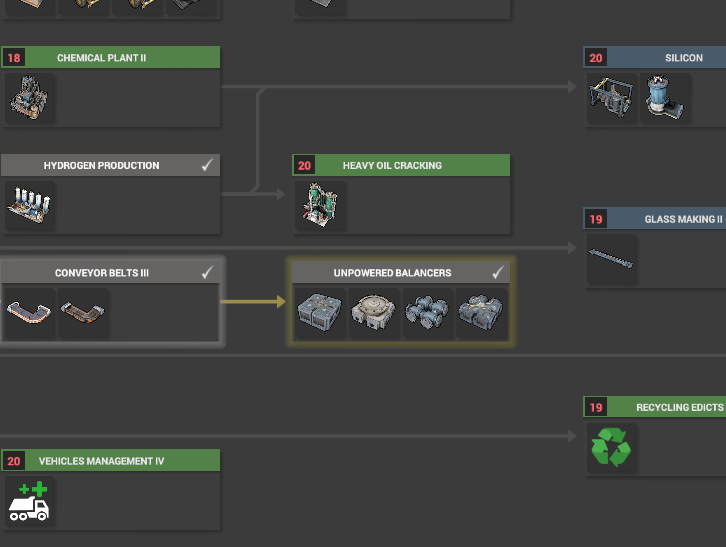

# UnpoweredBalancers

Provides balancers to the game that do not require electricity to operate.

# How to install

> :warning: **You will need to start a new game to play this mod. This is a restriction of CoI.**

1. From the downloaded zip, copy the contents of the `Mods` folder to your Captain of Industry `Mods` folder.

    By default, this is `Documents\Captain of Industry\Mods`. You can find out where exactly by running the following in PowerShell:
    ```powershell
    ((new-object -COM Shell.Application).Namespace(0x05).Self.Path + '\Captain of Industry\Mods')
    ```

2. Verify you have something like the following for each of the mods you installed, inside each folder should be a dll file with the same name as the folder.

3. Start a new game!

# How to use

After research, simply place them down as you would a normal balancer.

## Research
* **Unpowered balancers**: dependant on *Conveyor Belts III and Pipes III* first being completed.

